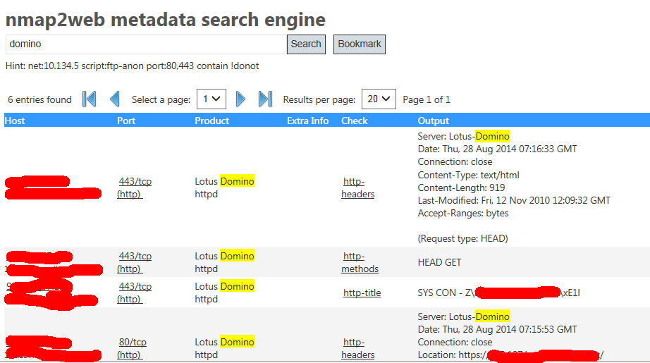
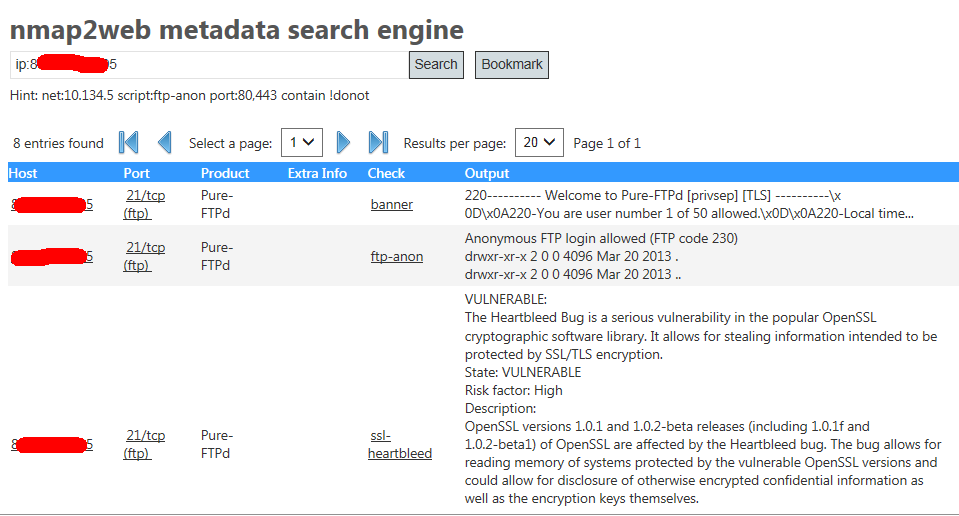
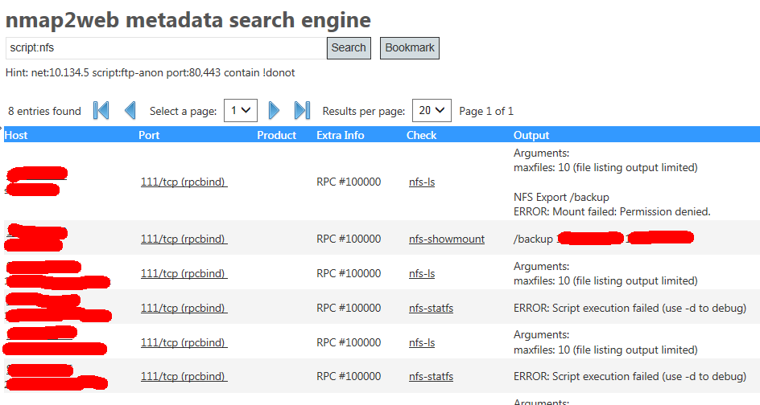
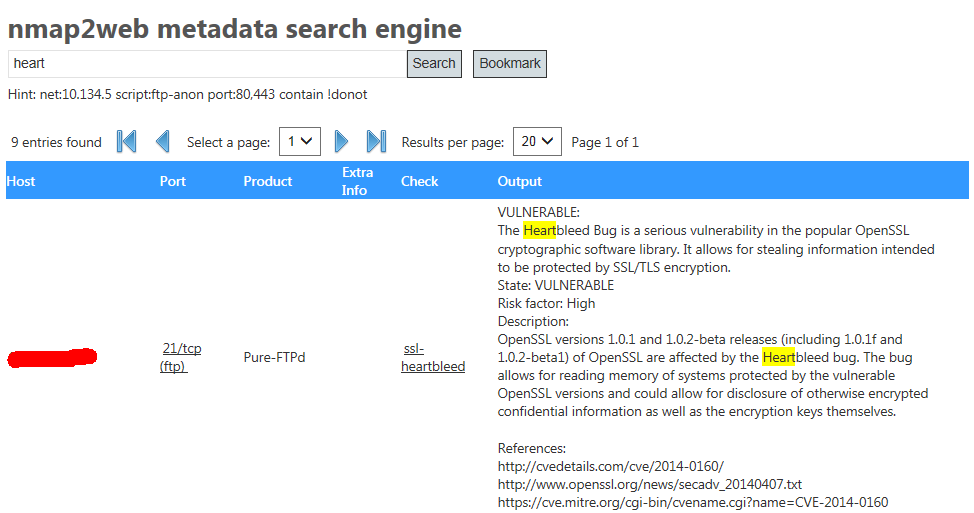

# nmap2web
Full text search engine for nmap  results. Written in C# ASP.NET

## Workflow

Scan a network range with your favourite nmap command. Use the `-oA filename` or `-oX filename` to save the results into an XML file.
My favourite is in [scan.sh](scan.sh).
  
  nmap -p T:21,22,23,25,32,79,80,110,111,135,137,139,143,389,443,445,855,871,873,993,995,1090,1098,1099,1100,1101,1198,1433,1556,1577,
  1882,1900,3128,3260,3306,3343,3389,3528,3873,4095,4105,4444,4445,4446,4447,4448,4457,4712,4713,4750,5001,5353,5666,5701,5900,6400,
  6410,7900,8000,8001,8005,8009,8080,8083,8118,8222,8333,8443,8512,8730,9092,10000,12489,13184,13724,13782,17185,18080,20080,20389,
  20390,20391,20394,20396,20398,20404,20410,20411,20443,22001,22002,22099,27864,36972,44441,44442,44443,44444,47001,48000,48001,
  48004,48005,48006,48007,48008,48009,48010,49152,49153,49154,52752,U:161 --script banner,finger,ftp-anon,
  http-comments-displayer,http-git,http-gitweb-projects-enum,http-headers,http-methods,http-open-proxy,http-php-version,
  http-title,http-trace,http-vmware-path-vuln,http-vuln-cve2010-0738,ajp-headers,imap-capabilities,iscsi-enum-targets,
  iscsi-info,ldap-rootdse,ms-sql-info,msrpc-enum,mysql-info,nbstat,nfs-ls,nfs-showmount,nfs-statfs,p2p-conficker,
  pop3-capabilities,realvnc-auth-bypass,rmi-dumpregistry,rpcinfo,rsync-list-modules,smb-check-vulns,smb-enum-shares,
  smb-os-discovery,smb-system-info,snmp-interfaces,snmp-netstat,upnp-info,snmp-sysdescr,ssl-heartbleed,
  vnc-info --script-args=checkconficker=1,safe=1,smbbasic=1 -oA nmapout -sS -Pn -sV -sU --max-retries 2 --open scanned_hosts

Take the nmap's XML output and convert it to a T-SQL script:

  xsltproc nmap2sql.xsl nmapout.xml > nmapout.sql
  
Import results into the SQL database:

  sqlcmd -S myServer\instanceName -i nmapout.sql

Run the nmap2web ASP.NET for the full text search

## Full text search commands

Use may use the commands below or any combination of them:

- **word1 word2** - matches "word1" and "word2"
- **word1 !word2** - matches "word1" and not "word2"
- **ip:a.b.c.d** - shows all records for ip address a.b.c.d
- **script:xyz** - shows all entries detected by nmap nse script "xyz"
- **net:a.b.c** - shows all entries for the subnet a.b.c.\*
- **port:aaa,bbb** - shows all entries for a network port aaa or bbb, e.g. 80,443 for http/https

## Screenshots / Examples

_(The IP addresses and hostnames are masked)_

__Full text search example__

__List all available information about single host__

__Detect available nfs servers__

__Detect host with heartbleed bug__

